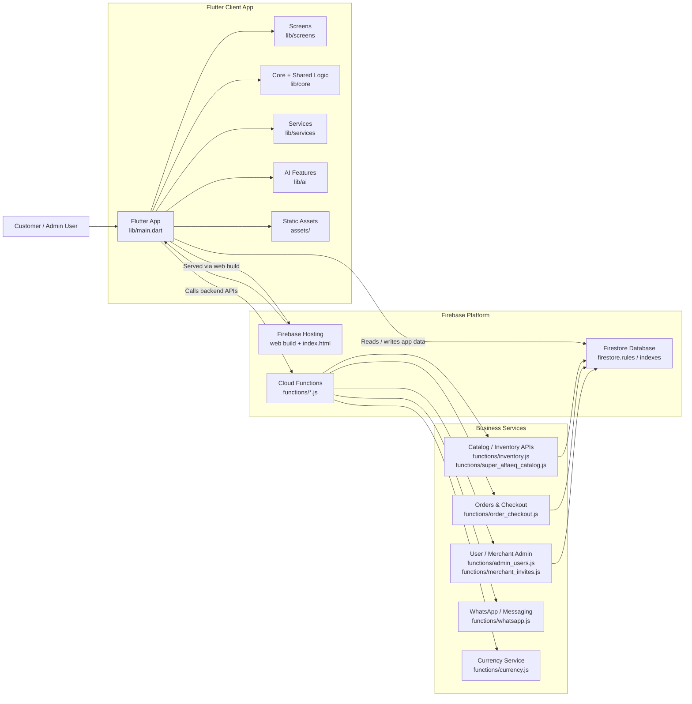

# Architecture Overview

This project is a Flutter-based storefront application deployed through Firebase, with backend business logic and data storage managed in the Firebase ecosystem.

## Components

- Flutter client app: main application UI and business logic located under `lib/`.
- Firebase Hosting: serves the production web bundle from `build/web`.
- Firestore: holds application data and access rules defined in `firestore.rules`.
- Cloud Functions: backend logic for catalog, checkout, user management, merchant invites, WhatsApp notifications, and currency integration.
- Assets: product and catalog data under `assets/` and supporting web/static content.

## Typical request flow

1. User interacts with the Flutter application.
2. App reads configuration and data from Firestore or backend APIs.
3. Cloud Functions process business operations such as inventory updates or order checkout.
4. Results are returned to the client or persisted to Firestore.
5. Firebase Hosting serves the compiled web frontend for browser access.
