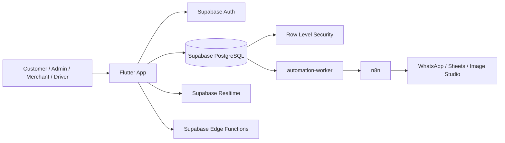

# Architecture Overview

الفائق يمن منصة Flutter إنتاجية تستخدم Supabase كطبقة الخلفية الوحيدة.

```mermaid
flowchart LR
    User[Customer / Admin / Merchant / Driver]
    App[Flutter App]
    Auth[Supabase Auth]
    DB[(Supabase PostgreSQL)]
    RLS[Row Level Security]
    Realtime[Supabase Realtime]
    Edge[Supabase Edge Functions]
    Automation[automation-worker]
    N8N[n8n]
    External[WhatsApp / Sheets / Image Studio]

    User --> App
    App --> Auth
    App --> DB
    DB --> RLS
    App --> Realtime
    App --> Edge
    DB --> Automation
    Automation --> N8N
    N8N --> External
```

## Backend responsibilities

- Supabase Auth: التسجيل، تسجيل الدخول، الجلسات وإعادة تعيين كلمة المرور.
- PostgreSQL: المستخدمون، المتاجر، المنتجات، المخزون، السلال، الطلبات، المدفوعات، المحافظ، التسويات، الإشعارات، المحادثات والأتمتة.
- RLS: التحكم في الوصول على مستوى الصفوف.
- Realtime: التحديثات الحية للطلبات والسلال والمندوبين والرسائل حيثما كانت القناة مفعلة.
- Edge Functions: العمليات الموثوقة التي لا ينبغي تنفيذها بمفتاح عميل.
- automation-worker: معالجة أحداث الأتمتة وإرسالها إلى الخدمات الخارجية.

## قاعدة إنتاجية

لا يوجد Firebase Hosting أو Firestore أو Cloud Functions ضمن runtime للمنصة. بناء Web يتم عبر GitHub Actions ثم GitHub Pages، بينما بيانات التطبيق وخدماته الخلفية في Supabase.
